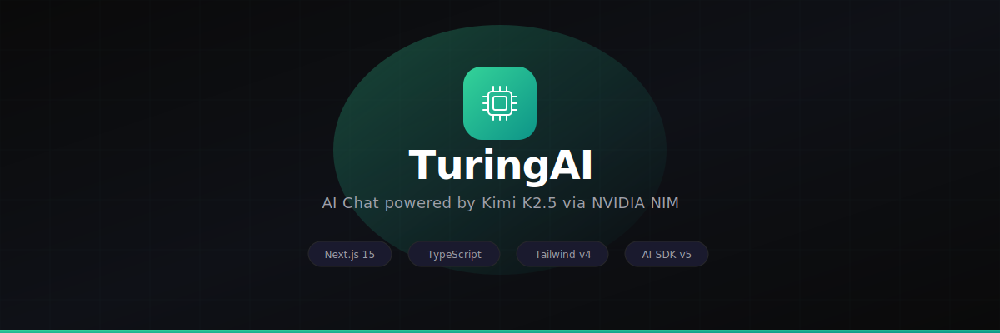
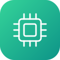

<p align="center">
  
</p>

<p align="center">
  <strong>Your personal AI chat — fast, private, and beautiful.</strong>
</p>

<p align="center">
  <a href="https://turing-ai-one.vercel.app/"></a>
</p>

<p align="center">
  <a href="#features"></a>
  <a href="#tech-stack"></a>
  <a href="#tech-stack"></a>
  <a href="#tech-stack"></a>
  <a href="#tech-stack"></a>
</p>

---

## Live Demo

**[https://turing-ai-one.vercel.app](https://turing-ai-one.vercel.app/)** — try it now, no sign-up needed.

---

## Features

<table>
<tr>
<td width="50%">



### Streaming Chat
Real-time token-by-token responses from **Kimi K2.5** via NVIDIA NIM API. No waiting — watch answers appear as they're generated.

</td>
<td width="50%">

### 🔍 Web Search
Toggle live web search to ground responses in real-time data. Powered by Serper.dev with 2,500 free queries.

</td>
</tr>
<tr>
<td>

### 🧠 Think Mode
Deep reasoning toggle that lets the AI think more carefully before responding. Great for complex problems.

</td>
<td>

### 🎨 Canvas Mode
Switch to canvas mode for creative and visual tasks directly in the chat interface.

</td>
</tr>
<tr>
<td>

### 🎙️ Voice Recording
Built-in voice recorder with real-time visualizer. Record voice messages directly in the chat.

</td>
<td>

### 📎 Image Upload
Drag-and-drop or paste images directly into the chat. Full preview with lightbox viewer.

</td>
</tr>
<tr>
<td>

### 💬 Conversation History
All chats persist in localStorage. Switch between conversations, pick up where you left off — even after closing the browser.

</td>
<td>

### 🌗 Orange Theme (Dark / Light)
Warm orange & white in light mode, neon orange & black in dark mode. Animated toggle with smooth transitions.

</td>
</tr>
<tr>
<td>

### 🔤 Font Picker
Choose between 4 premium fonts — Inter, DM Sans, Plus Jakarta Sans, and Space Grotesk — right from the settings panel.

</td>
<td>

### 💻 Code Blocks
Syntax-highlighted code with dark backgrounds and a **one-click copy** button. Clean rendering for any language.

</td>
</tr>
<tr>
<td>

### 🔐 WebGL Sign-In Flow
Stunning sign-in page with animated dot matrix canvas effect, three-step auth flow, and responsive floating navbar.

</td>
<td>

### 📱 Responsive Design
Desktop, tablet, mobile — adapts seamlessly. Hamburger menu on small screens, collapsible sidebar on large.

</td>
</tr>
</table>

---

## Tech Stack

```
Frontend     Next.js 16  ·  TypeScript  ·  Tailwind CSS v4  ·  Framer Motion
UI           Radix UI (Dialog, Tooltip)  ·  Lucide React  ·  Three.js
AI Layer     Vercel AI SDK v6  ·  @ai-sdk/openai-compatible
LLM          Kimi K2.5 via NVIDIA NIM
Search       Serper.dev API
Storage      localStorage (zero backend)
Hosting      Vercel (Hobby — free tier)
```

---

## Quick Start

```bash
# 1. Clone
git clone https://github.com/Himanshub15/TuringAI.git && cd TuringAI

# 2. Install
npm install

# 3. Configure
cp .env.example .env.local
# Add your NVIDIA_API_KEY (required) and SERPER_API_KEY (optional)

# 4. Run
npm run dev
```

Open **http://localhost:3000** and start chatting.

### Get API Keys

| Key | Where | Cost |
|-----|-------|------|
| `NVIDIA_API_KEY` | [build.nvidia.com](https://build.nvidia.com/) | Free tier available |
| `SERPER_API_KEY` | [serper.dev](https://serper.dev/) | 2,500 free queries |

---

## Project Structure

```
src/
├── app/
│   ├── api/
│   │   ├── chat/route.ts             # Streaming chat endpoint
│   │   └── search/route.ts           # Web search proxy
│   ├── login/page.tsx                # WebGL sign-in flow
│   ├── layout.tsx                    # Root layout + fonts + theme
│   ├── page.tsx                      # Main chat page
│   └── globals.css                   # Global styles + aurora animation
├── components/
│   ├── ui/
│   │   ├── ai-prompt-box.tsx         # Rich prompt input (search/think/canvas/voice/upload)
│   │   ├── theme-toggle.tsx          # Animated Sun/Moon toggle
│   │   └── sign-in-flow.tsx          # WebGL sign-in with Three.js
│   ├── hooks/
│   │   └── use-auto-resize-textarea.ts
│   ├── ChatInterface.tsx             # Chat orchestrator
│   ├── MessageList.tsx               # Message container + suggestions
│   ├── MessageBubble.tsx             # Message rendering + code blocks
│   ├── Sidebar.tsx                   # Sidebar + settings + font picker
│   └── TuringLogo.tsx               # Reusable SVG logo component
├── lib/
│   ├── nim.ts                        # NVIDIA NIM config
│   ├── conversations.ts              # localStorage CRUD
│   └── utils.ts                      # cn() utility
└── types/
    └── index.ts                      # Shared types
```

---

## Roadmap

- [x] ~~Deploy to Vercel~~ — **[Live now!](https://turing-ai-one.vercel.app/)**
- [x] Rich prompt box with Search / Think / Canvas toggles
- [x] Voice recording with visualizer
- [x] Image upload with drag-and-drop
- [x] WebGL animated sign-in page
- [x] Font picker (4 fonts)
- [x] Orange neon theme
- [ ] Google / Apple Sign-In integration
- [ ] Markdown rendering with `react-markdown`
- [ ] Export conversations
- [ ] Multi-model support

---

<p align="center">
  
  <br/>
  <sub>Built with Kimi K2.5 + NVIDIA NIM · Hosted on Vercel</sub>
</p>

## License

MIT
